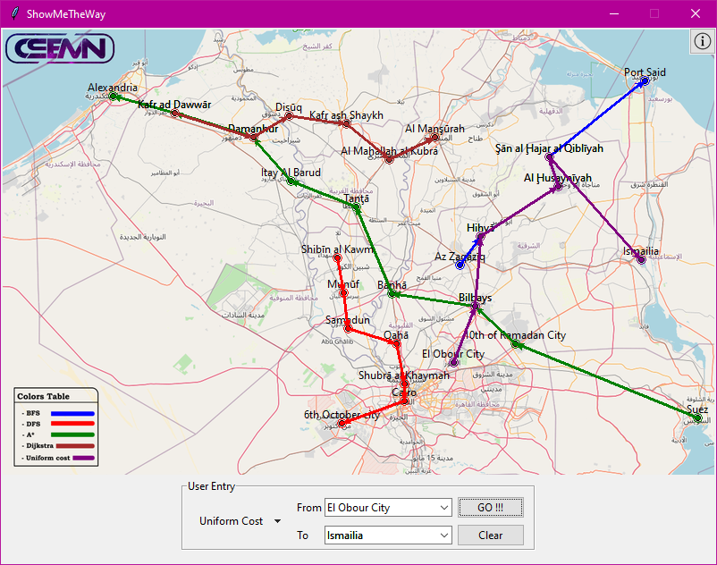
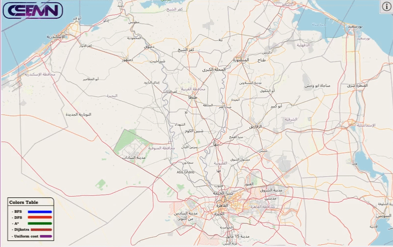

# ShowMeTheWay
 Python GUI (tkinter) project selects the best path to travel between certain Egyptian cities.  
 supports (A*,DFS,BFS,Uniform Cost,Dijkstra) searching algorithms.  
 Mainly developed to visualize the diffrence between different searching algorithms.  
 
   
 
 <h2>For getting started</h2>
 Main Entry point of the code is the <a href="https://github.com/CSEMN/ShowMeTheWay/blob/main/ShowMeTheWay.py">ShowMeTheWay.py</a> file from the main directory.
<h2>For execution</h2>
executable file (.exe) could be downloaded from <a href="https://github.com/CSEMN/ShowMeTheWay/releases/download/v1.7/ShowMeTheWay_v1.7.rar">Here</a>.
